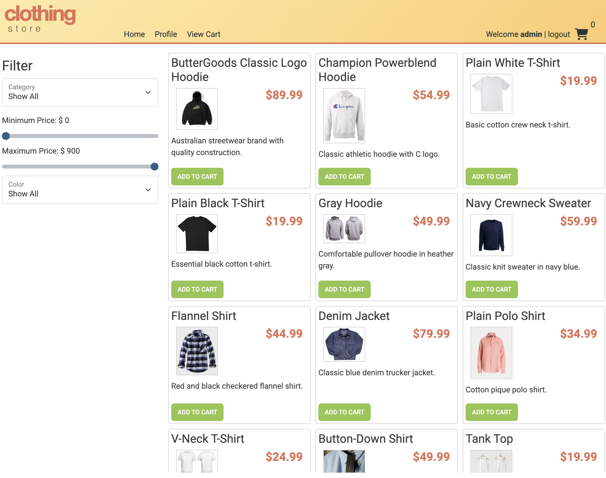
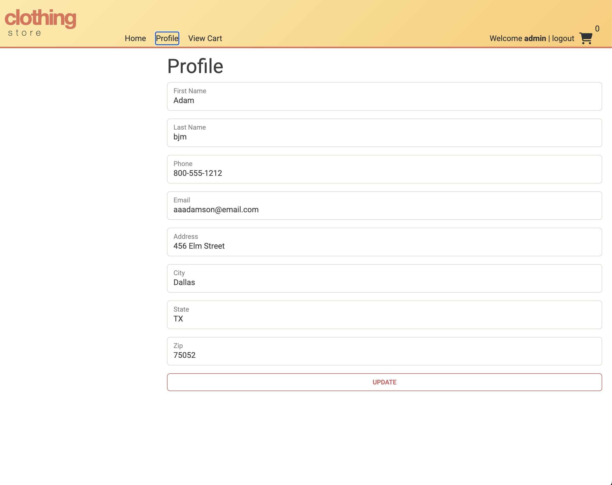
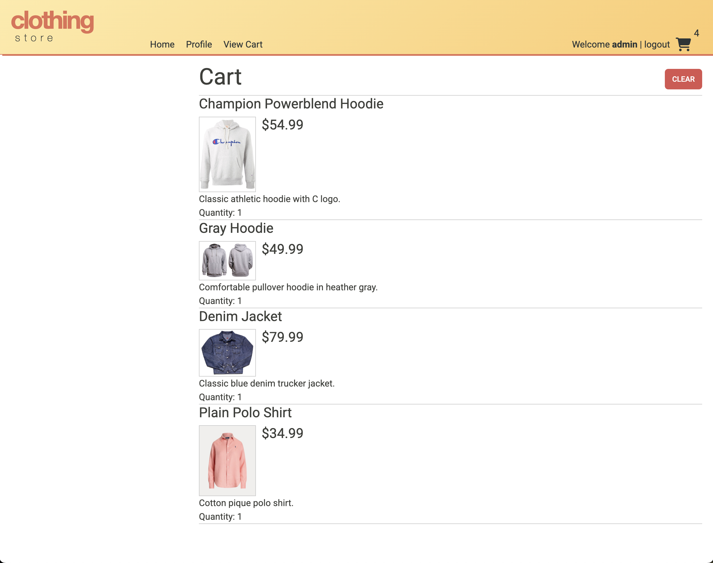

# Year Up Capstone API

A Spring Boot backend for an e-commerce-style application with product and category management, user profiles, shopping cart operations, and JWT-based authentication.

## Key Features

- Spring Boot 4 application
- Java 17 runtime
- RESTful API endpoints for products, categories, profile, shopping cart, and authentication
- JWT authentication and authorization
- Role-based access: `ROLE_USER` and `ROLE_ADMIN`
- MySQL persistence with Spring Data JPA

## Technology Stack

- Java 17
- Spring Boot 4.0.2
- Spring Security
- Spring Web MVC
- Spring Data JPA
- JSON Web Tokens (JJWT)
- MySQL connector


## Images of Project 


| Home Page | Profile  | Shopping Cart |
|---|---|---|
|  | | 


## Getting Started

### Prerequisites

- Java 17
- Maven (or use the included `mvnw` wrapper)
- MySQL database

## Authentication

- `POST /login` — authenticate and receive a JWT token
- `POST /register` — create a new user account

Use the returned token for protected requests with the `Authorization` header:

```http
Authorization: Bearer <token>
```

## Main API Endpoints

### Authentication

- `POST /login`
- `POST /register`

### Products

- `GET /products`
- `GET /products/{id}`
- `POST /products`
- `PUT /products/{id}`
- `DELETE /products/{id}`

### Categories

- `GET /categories`
- `GET /categories/{id}`
- `GET /categories/{categoryId}/products`
- `POST /categories`
- `PUT /categories/{id}`
- `DELETE /categories/{id}`

### Profile

- `GET /profile`
- `PUT /profile`

### Shopping Cart

- `GET /cart`
- `POST /cart/products/{id}`
- `PUT /cart/products/{id}`
- `DELETE /cart`

## Run The Project
1. Clone the repository
   ```bash
   git clone https://github.com/masterstrawberry/cloth-store.git
   ```

3. Configure database connection
The application expects a MySQL database. Default connection details are configured in `src/main/resources/application.properties`:
You can override the database name by setting the `DB_NAME` environment variable.

A sample database schema is available in `database/create_database_clothingstore.sql`.

   Update `src/main/resources/application.properties` with your local MySQL credentials:
   ```properties
   spring.datasource.url=jdbc:mysql://localhost:3306/<your_db_name>
   spring.datasource.username=<your_username>
   spring.datasource.password=<your_password>
   ```

4. Run application
   Run EcommerceApplication.java, app will start at `http://localhost:8080`.

5. Run frontend
  Open and navigate to index.html, click on browser icon to run.

6. Testing
   Import the Insomnia collection, remember to Log in via `/login` first and attach the returned JWT as a `Bearer` token in the `Authorization` header for any endpoint that requires authentication.

